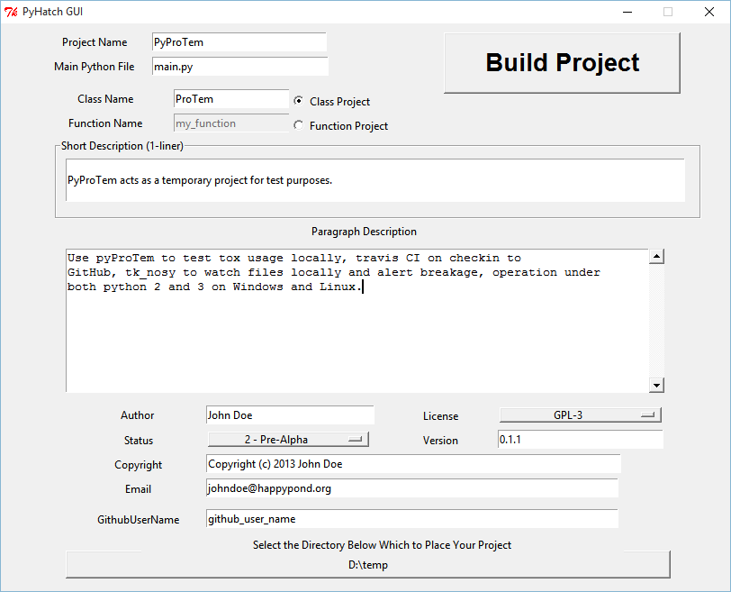

.. example

Example
=======

PyHatch Python Script
---------------------

An easy way to use ``PyHatch`` is to set up a python script that creates a 
``Hatch`` object and then saves that object to the subdirectory of your choice.

The example below will create a subdirectory called `PyProTem` in the 
user's home directory.  `PyProTem` will contain all the project files.

The `example_1.py` file from the installed example subdirectory is shown below::

    import sys
    import os

    from pyhatch.hatch_supt import Hatch

    SIMPLEDESC='''PyProTem acts as a temporary project for test purposes.'''

    LONGDESC="""Use pyProTem to test tox usage locally, travis CI on checkin to 
    GitHub, tk_nosy to watch files locally and alert breakage, operation under 
    both python 2 and 3 on Windows and Linux."""

    h = Hatch(projName='PyProTem', 
              mainPyFileName='main.py', 
              mainDefinesClass='Y',
              mainClassName='ProTem', 
              mainFunctionName='my_function',
              author='Some Guy', 
              github_user_name='somekindaguy',
              proj_copyright='Copyright (c) 2015 Some Guy',
              proj_license='GPL-3', 
              version='0.1.3', 
              email='someguy@someplace.com', 
              status='4 - Beta',
              simpleDesc=SIMPLEDESC, 
              longDesc=LONGDESC, 
              year=None,   # if None, set to this year
              organization=None)  # if None, set to author

    # This example places project into user home directory
    h.save_project_below_this_dir( os.path.expanduser('~/') )

PyHatch GUI
-----------

Another approach to creating a project is to simply type ``pyhatch`` in a terminal and the ``PyHatch GUI`` will start.  Fill in the information, select a target directory and click ``Build Project``.

.. note::
    Saving a Hatch object creates a ``PyHatch.cfg`` file in the user's home directory.  
    
    Once the ``PyHatch.cfg`` file exists the personal information on the ``PyHatch GUI`` will be filled in automatically.

It is also possible to run the ``PyHatch GUI`` directly from source without installing it. Simply navigate to the source files and type::

    python hatch_gui.py

